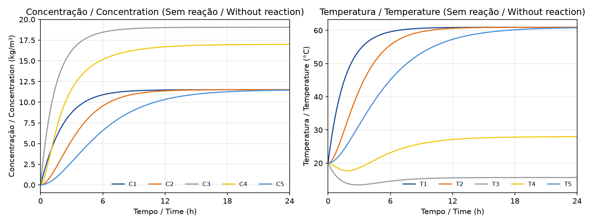
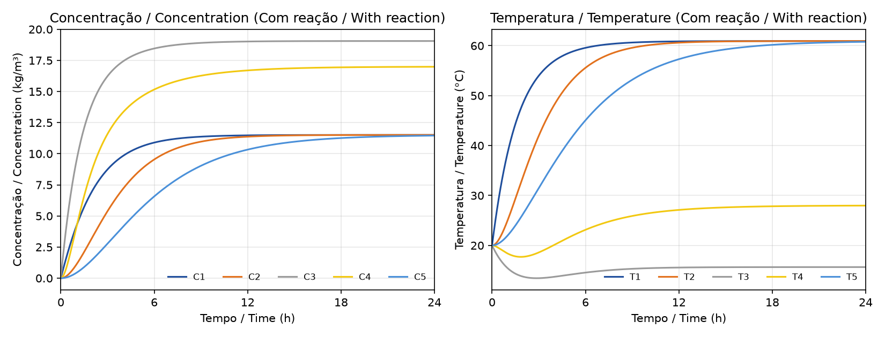

# Five-Tank Reactor Network — Runge-Kutta-Fehlberg Simulation

*University assignment (FURB — Modelos e Métodos Matemáticos em Engenharia Química) solved with a custom RKF45 ODE solver written in JavaScript.*

🇧🇷 [Leia em Português](#-pt-br) | 🇺🇸 [Read in English](#-en-us)

---

## 🇺🇸 EN-US

### What this repo is

This is a university project for the *Mathematical Models and Methods in Chemical Engineering* course at FURB (Fundação Universitária Regional de Blumenau). It implements the **Runge-Kutta-Fehlberg (RKF45)** method — an adaptive-step-size numerical ODE solver — from scratch in plain JavaScript, and uses it to simulate the transient behavior of a network of interconnected mixing tanks with an optional exothermic chemical reaction.

- `rkf.js` — the generic RKF45 solver (adaptive step size, embedded 4th/5th order error estimate). Knows nothing about tanks.
- `engine.js` — generic mixing-tank network engine: builds the mass/energy balance ODEs for any set of tanks/pipes you give it and runs them through `rkf.js`.
- `problem.js` — the FURB assignment expressed as plain data (tanks, pipes, reaction kinetics, fluid properties, simulation settings) consumed by `engine.js`.
- `codigo.js` — Node CLI: loads `problem.js` (or a custom problem JSON), runs `engine.js`, prints progress, and exports the results to CSV.
- `index.html` / `app.js` — a browser UI to build a tank network interactively (add/remove tanks and pipes, set initial conditions, reaction and fluid parameters), run the same engine client-side, and view live concentration/temperature charts. See "Interactive web UI" below.
- `Ricardo_Solução.pdf` — the full handed-in solution: the derivation of the balance equations, the RKF theory, the annotated code, and the final result plots/tables.
- `PROBLEMA_ORIGINAL.md` — the original assignment statement, in Portuguese, exactly as given by the professor (kept for reference).
- `tanques.png` — the tank/pipe network diagram (see below).

### What is RKF (Runge-Kutta-Fehlberg)?

RKF45 is a numerical method for solving ordinary differential equations (ODEs) that don't have a closed-form analytical solution. Like the classic Runge-Kutta method, it advances the solution step by step using a weighted combination of derivative evaluations at intermediate points. What makes it special is that it computes **two solutions of different order (4th and 5th)** at every step using the same function evaluations; the difference between them estimates the local error, which is used to automatically shrink or grow the step size (`h`) — small steps where the solution changes fast, large steps where it doesn't. This makes it accurate and efficient without having to hand-tune the step size.

### The problem

Five perfectly-mixed, adiabatic tanks (volumes 10, 5, 12, 6 and 15 m³) are connected by pipes as shown below. Two external feed streams enter the network:

- Feed into Tank 1: 5 m³/h at 10 g/L, 70 °C
- Feed into Tank 3: 8 m³/h at 20 g/L, 10 °C


An exothermic decomposition reaction of a generic species may take place inside the tanks, with kinetics `r = -k·C²`, where `k = 10³·exp((34.34 − 34222)/T)` L/(g·min) (T in Kelvin) and released energy `ΔHr = -80,000 J/g`.

**Goal:** starting from 0 g/L concentration and 20 °C in every tank, determine the evolution of concentration (C₁…C₅) and temperature (T₁…T₅) over 24 hours, for two cases:
1. Without reaction (linear ODE system).
2. With reaction (non-linear ODE system).

The system boils down to 10 coupled ODEs (mass and energy balance per tank), solved simultaneously with the RKF45 method.

### Results

**Case 1 — without reaction** (final state at t = 24 h):

| Tank | Concentration [kg/m³] | Temperature [°C] |
|---|---|---|
| 1 | 11.509320 | 60.943131 |
| 2 | 11.508919 | 60.942195 |
| 3 | 19.056452 | 15.660023 |
| 4 | 16.987256 | 27.976814 |
| 5 | 11.458546 | 60.788266 |

**Case 2 — with reaction** (final state at t = 24 h):

| Tank | Concentration [kg/m³] | Temperature [°C] |
|---|---|---|
| 1 | 11.509320 | 60.943131 |
| 2 | 11.508919 | 60.942195 |
| 3 | 19.056452 | 15.660023 |
| 4 | 16.987256 | 27.976814 |
| 5 | 11.458546 | 60.788266 |

The two cases converge to essentially the same values: the reaction rate constant, evaluated at the process temperatures, is many orders of magnitude smaller than the mass/energy exchanged by the flows in and out of each tank (e.g. `dC1/dt` inflow/outflow term ≈ 1.25×10⁻³ vs. reaction term ≈ 1.13×10⁻⁴⁸), so the reaction term is effectively negligible here. That is also why the transient curves below look identical for both cases:

**Without reaction:**


**With reaction:**


Full step-by-step derivation, the RKF theory, and the error-tolerance/step-size sensitivity discussion (including a divergence case caused by too large a max step) are in [`Ricardo_Solução.pdf`](Ricardo_Solução.pdf) — note the plots there were generated before the RKF indexing bug fix below, so the exact curve values differ very slightly from the ones shown here.

### Running it

```bash
node codigo.js            # defaults to the reaction case set in problem.js
node codigo.js true       # force the reaction case ON
node codigo.js false      # force the reaction case OFF
node codigo.js true my-network.json   # use a custom problem file (see problem.js for the shape)
```

`true/1/com/cr` and `false/0/sem/sr` are all accepted as the argument. Results are written to `resultados_sr.csv` (sem reação) or `resultados_cr.csv` (com reação).

### Interactive web UI

Open `index.html` in a browser (or serve the folder, e.g. `npx serve .` / `python3 -m http.server`) to build and solve a tank network with no code:

- Add/remove tanks with a name, initial concentration, initial temperature, volume, and a "fixed" flag (for feed/discharge nodes whose C/T never change).
- Add/remove pipes by picking the *from* and *to* tanks from dropdowns and setting the flow rate.
- Tune reaction kinetics (pre-exponential factor, activation term, ΔHr), fluid properties (ρ, Cp), and simulation settings (duration, initial step, tolerance, sampling interval).
- Click **Calculate** to solve the same ODE system as the CLI, right in the browser, with live concentration/temperature-vs-time charts and a final-state table.
- **Export CSV** downloads the time series; **Export problem JSON** downloads the current network definition so it can be re-run with `node codigo.js true my-network.json`.
- **Load FURB example** restores the original 5-tank assignment at any time.

The default network loaded on page open is exactly the one in `problem.js`.

### Known issue (fixed)

`rkf.js` had a bug in the stage-evaluation step: when building the perturbed state vector for each intermediate stage, every component reused the *outer* equation index (`j`) instead of its *own* component index, so components other than the first were perturbed with the wrong slope. This only produces a visibly wrong result for systems where the state components evolve differently and are tightly coupled (verified against a harmonic oscillator with a known analytical solution: error dropped from ~4×10⁻² to ~10⁻¹³ after the fix). For this specific tank dataset the effect was small (4th–5th decimal place) because the adaptive step size ends up very small anyway, but the fix is now applied.

---

## 🇧🇷 PT-BR

### O que é este repositório

Este é um projeto acadêmico da disciplina de *Modelos e Métodos Matemáticos em Engenharia Química* da FURB (Fundação Universitária Regional de Blumenau). Nele foi implementado, do zero, em JavaScript puro, o método **Runge-Kutta-Fehlberg (RKF45)** — um solver numérico de EDOs com passo adaptativo — utilizado para simular o comportamento transiente de uma rede de tanques de mistura interligados, com uma reação química exotérmica opcional.

- `rkf.js` — o solver RKF45 genérico (passo adaptativo, estimativa de erro embutida entre 4ª e 5ª ordem). Não sabe nada sobre tanques.
- `engine.js` — motor genérico de rede de tanques: monta as EDOs de balanço de massa e energia para qualquer conjunto de tanques/tubulações fornecido e resolve com o `rkf.js`.
- `problem.js` — o trabalho da FURB descrito como dados simples (tanques, tubulações, cinética da reação, propriedades do fluido, configurações da simulação), consumido pelo `engine.js`.
- `codigo.js` — CLI em Node: carrega o `problem.js` (ou um JSON de problema personalizado), executa o `engine.js`, imprime o progresso e exporta os resultados em CSV.
- `index.html` / `app.js` — uma interface web para montar uma rede de tanques interativamente (adicionar/remover tanques e tubulações, definir condições iniciais, parâmetros de reação e fluido), rodar o mesmo motor no navegador e ver gráficos de concentração/temperatura em tempo real. Veja "Interface web interativa" abaixo.
- `Ricardo_Solução.pdf` — a solução completa entregue: dedução das equações de balanço, teoria do RKF, código comentado e os gráficos/tabelas de resultado finais.
- `PROBLEMA_ORIGINAL.md` — o enunciado original do trabalho, tal como fornecido pelo professor (mantido para referência).
- `tanques.png` — o diagrama da rede de tanques e tubulações (veja abaixo).

### O que é o RKF (Runge-Kutta-Fehlberg)?

O RKF45 é um método numérico para resolver equações diferenciais ordinárias (EDOs) que não possuem solução analítica fechada. Assim como o método clássico de Runge-Kutta, ele avança a solução passo a passo usando uma combinação ponderada de avaliações da derivada em pontos intermediários. Sua particularidade é calcular **duas soluções de ordens diferentes (4ª e 5ª)** a cada passo, reaproveitando as mesmas avaliações da função; a diferença entre elas estima o erro local, usado para aumentar ou reduzir automaticamente o tamanho do passo (`h`) — passos pequenos onde a solução varia rápido, passos grandes onde ela é mais estável. Isso garante precisão e eficiência sem a necessidade de ajustar manualmente o passo.

### O problema

Cinco tanques de mistura perfeita, adiabáticos (volumes de 10, 5, 12, 6 e 15 m³) são interligados por tubulações conforme o diagrama abaixo. Duas correntes de alimentação externas entram na rede:

- Alimentação no Tanque 1: 5 m³/h a 10 g/L, 70 °C
- Alimentação no Tanque 3: 8 m³/h a 20 g/L, 10 °C


Uma reação química de decomposição exotérmica de uma espécie genérica pode ocorrer nos tanques, com cinética `r = -k·C²`, onde `k = 10³·exp((34,34 − 34222)/T)` L/(g·min) (T em Kelvin) e energia liberada `ΔHr = -80.000 J/g`.

**Objetivo:** partindo de concentração 0 g/L e temperatura 20 °C em todos os tanques, determinar a evolução da concentração (C₁…C₅) e da temperatura (T₁…T₅) ao longo de 24 horas, em dois casos:
1. Sem reação (sistema linear de EDOs).
2. Com reação (sistema não-linear de EDOs).

O sistema resulta em 10 EDOs acopladas (balanço de massa e energia por tanque), resolvidas simultaneamente com o método RKF45.

### Resultados

**Caso 01 — sem reação** (condição final em t = 24 h):

| Tanque | Concentração [kg/m³] | Temperatura [°C] |
|---|---|---|
| 1 | 11.509320 | 60.943131 |
| 2 | 11.508919 | 60.942195 |
| 3 | 19.056452 | 15.660023 |
| 4 | 16.987256 | 27.976814 |
| 5 | 11.458546 | 60.788266 |

**Caso 02 — com reação** (condição final em t = 24 h):

| Tanque | Concentração [kg/m³] | Temperatura [°C] |
|---|---|---|
| 1 | 11.509320 | 60.943131 |
| 2 | 11.508919 | 60.942195 |
| 3 | 19.056452 | 15.660023 |
| 4 | 16.987256 | 27.976814 |
| 5 | 11.458546 | 60.788266 |

Os dois casos convergem para praticamente os mesmos valores: a constante de velocidade de reação, avaliada nas temperaturas do processo, é muitas ordens de grandeza menor que os termos de entrada/saída de massa e energia de cada tanque (ex.: termo de entrada/saída em `dC1/dt` ≈ 1,25×10⁻³ contra termo de reação ≈ 1,13×10⁻⁴⁸), tornando a reação praticamente desprezível neste caso. É por isso que as curvas de evolução temporal abaixo são praticamente idênticas nos dois casos:

**Sem reação:**


**Com reação:**


A dedução completa, a teoria do RKF e a discussão sobre sensibilidade de tolerância/passo (incluindo um caso de divergência causado por um passo máximo grande demais) estão em [`Ricardo_Solução.pdf`](Ricardo_Solução.pdf) — os gráficos lá foram gerados antes da correção do bug de indexação do RKF (abaixo), então os valores exatos das curvas diferem levemente dos apresentados aqui.

### Executando

```bash
node codigo.js            # padrão: caso de reação definido em problem.js
node codigo.js true       # força o caso com reação
node codigo.js false      # força o caso sem reação
node codigo.js true minha-rede.json   # usa um arquivo de problema personalizado (veja o formato em problem.js)
```

Os valores `true/1/com/cr` e `false/0/sem/sr` são aceitos como argumento. Os resultados são salvos em `resultados_sr.csv` (sem reação) ou `resultados_cr.csv` (com reação).

### Interface web interativa

Abra `index.html` no navegador (ou sirva a pasta, ex.: `npx serve .` / `python3 -m http.server`) para montar e resolver uma rede de tanques sem escrever código:

- Adicione/remova tanques com nome, concentração inicial, temperatura inicial, volume e uma marcação "fixo" (para nós de alimentação/descarga cujo C/T nunca mudam).
- Adicione/remova tubulações escolhendo os tanques de *origem* e *destino* em menus suspensos e definindo a vazão.
- Ajuste a cinética da reação (fator pré-exponencial, termo de ativação, ΔHr), propriedades do fluido (ρ, Cp) e configurações da simulação (duração, passo inicial, tolerância, intervalo de amostragem).
- Clique em **Calculate** para resolver o mesmo sistema de EDOs do CLI, direto no navegador, com gráficos de concentração/temperatura em tempo real e uma tabela de condição final.
- **Export CSV** baixa a série temporal; **Export problem JSON** baixa a definição da rede atual, que pode ser reexecutada com `node codigo.js true minha-rede.json`.
- **Load FURB example** restaura o problema original de 5 tanques a qualquer momento.

A rede carregada por padrão ao abrir a página é exatamente a definida em `problem.js`.

### Problema conhecido (corrigido)

O `rkf.js` tinha um bug na etapa de avaliação dos estágios: ao montar o vetor de estado perturbado para cada estágio intermediário, todos os componentes reutilizavam o índice da equação *externa* (`j`) em vez do índice do *próprio* componente, fazendo com que componentes além do primeiro fossem perturbados com a inclinação errada. Isso só produz um resultado visivelmente incorreto em sistemas cujos componentes evoluem de forma diferente e fortemente acoplada (verificado com um oscilador harmônico de solução analítica conhecida: o erro caiu de ~4×10⁻² para ~10⁻¹³ após a correção). Para este conjunto de dados dos tanques, o efeito foi pequeno (4ª–5ª casa decimal), pois o passo adaptativo acaba ficando muito pequeno de qualquer forma, mas a correção já está aplicada.
